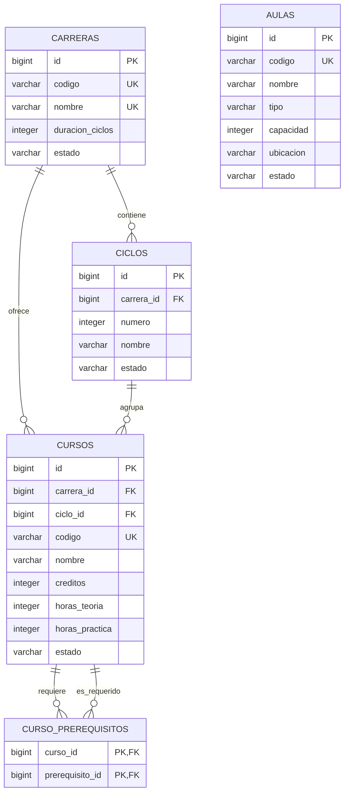

# Modelo entidad-relación del Servicio de Cursos

La base no contiene usuarios, docentes, secciones ni matrículas. Esos datos pertenecen a otros microservicios y se relacionarán mediante identificadores y APIs REST.
