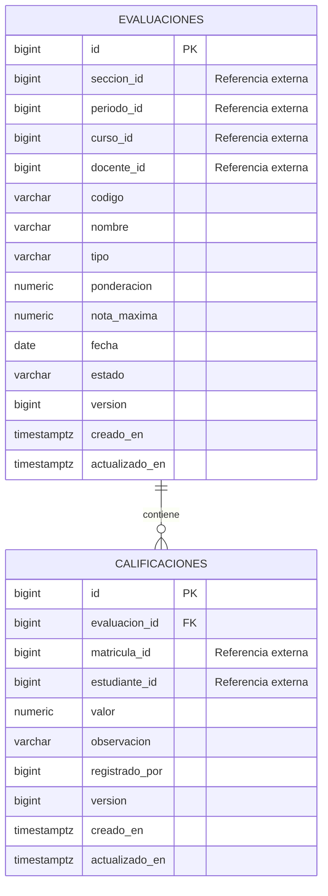

# Modelo entidad-relación: Servicio de Evaluaciones

`seccion_id`, `periodo_id`, `curso_id`, `docente_id`, `matricula_id` y `estudiante_id` no son llaves foráneas locales. Se validan mediante APIs REST para conservar el aislamiento de bases de datos entre microservicios.
