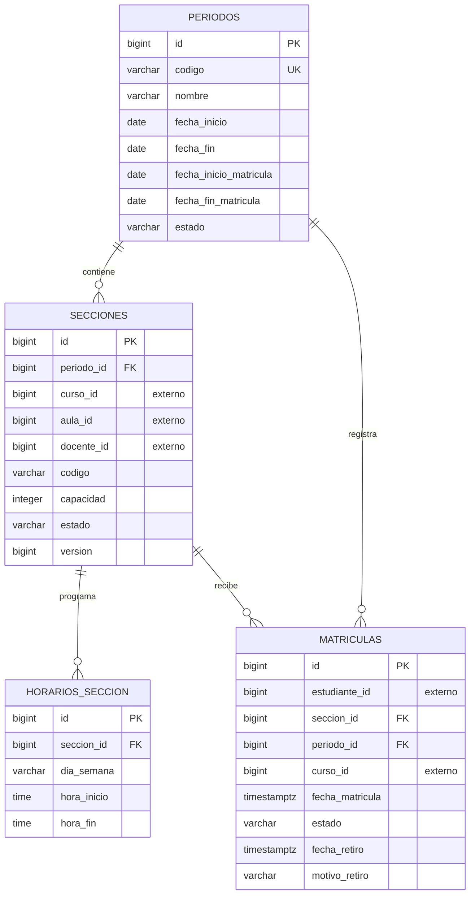

# Modelo entidad-relación del Servicio de Matrículas

`curso_id`, `aula_id`, `docente_id` y `estudiante_id` son identificadores externos. Su validez se comprueba mediante APIs REST y no mediante claves foráneas hacia bases de otros microservicios.
