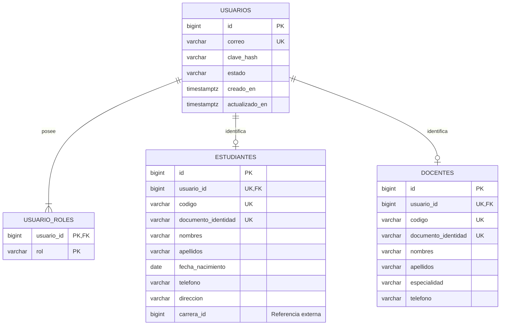

# Modelo entidad-relación del Servicio de Usuarios

`carrera_id` no tiene clave foránea local porque la entidad Carrera pertenecerá al microservicio de Cursos. Su validez se comprobará mediante API REST cuando ese servicio sea implementado.
